# quarantinis: A Cocktail Generator 

<strong>View Deployed Project here:<strong> https://koltondecker.github.io/quarantinis/

## Application

A significant (and potentially the most important) part of the bar experience is ….well the drinks. UNFORTUNATELY, a pandemic that has been ravaging the nation makes attending bars a little more complicated and risky. Never fear though, Quartini is here to save the day (or the night rather).
So what is Quartini you ask?  
Quartini is a platform that provides cocktail suggestions (and their accompanying recipes) based on a user’s selected base liquor. Off from work and need a stiff whiskey cocktail help you ease into the night? Quaratini has you covered. Need a rum cocktail to pair with that jerk chicken recipe you randomly found on instagram? Quartini also has you covered. Finally brave enough to make that shaky taco recipe for your wife but want to guarantee that she at least enjoys the tequila? Guess what - Quaratini has you covered. 
Safely capture a part of the bar experience from the confines of your home and give Quaritini a shot!
(PS: Did we mention that you can store cocktails recipes you liked for future reference?)

## User Story (Draft)

‘’’
AS A prisoner to the pandemic
I WANT to discover and store drink recipes based on my selected criteria   
SO THAT I can have a damn drink without having to potentially expose myself to a deadly virus.
‘’’’

## Functionality Criteria

```
GIVEN a homepage with form selector inputs
WHEN I select a liquor, quantity of desired recipes returned and click 'get litty'
- THEN I am presented with the appropriate amount of recipes (assuming API database has enough recipes with criteria) returned from CocktailDB API that contain that liquor and are displayed on page as cards
WHEN I click the plus button on a displayed card
- THEN I am presented with a modal popup that displays the full recipe information for that cocktail
WHEN I click the save recipe button on the modal popup
- THEN the modal closes and the recipe is saved to local storage as an object.
WHEN I submit a new search
- THEN I am presented with a new list of cocktails (assuming API database for that liquor is large enough)
WHEN I navigate to the saved recipes page
- THEN I am presented with a default list view of all recipes I have saved
WHEN I click on a list view recipe
- THEN I am presented with a dropdown of the full recipe with a button to delete recipe at the bottom
WHEN I click the delete recipe button
- THEN I am presented with an updated list of saved recipes without the one deleted and local storage is updated
WHEN I toggle to card view
- THEN I am presented with a series of cards that display the recipe picture and title and a plus button as seen on generator page
WHEN I click the plus button
- THEN I am presented with a modal popup of the full recipe with option to delete recipe at bottom
WHEN I click the delete recipe button
- THEN I am presented with an updated series of cards of saved recipes without the deleted recipe card and local storage is updated
WHEN I leave and return to saved recipes page
- THEN I am presented with saved recipes page that is stored in local storage unless this has been manually deleted outside of website
WHEN I navigate to Breweries page
- THEN I am presented with a search input form for a city, presented with a map of the United States, and an empty table of brewery information
WHEN I search a city
- THEN I am presented with map markers that mark all breweries in that city (per the API if coordinates were available)
WHEN I search a city
- THEN I am also presented with a table of information for all the breweries including address and website link
WHEN I search a new city
- THEN I am presented with a new set of markers and new table and all previous markers are removed from the map
```

The following demonstrates the application functionality:

<h2><strong>General Functionality:</strong></h2>
<br>
<h3><strong>Landing Page</strong></h3>
<br>
- This is what the page looks like on initial page load:
<br>
<br>
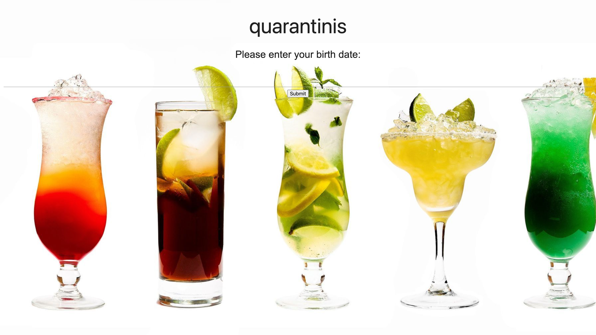
<br>
<br>
- When user selects the input line, a datepicker modal pops up for user to input birthday:
<br>
<br>
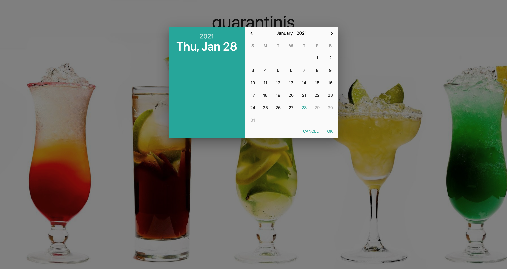
<br>
<br>
- If user submits a birthday that is under the age of 21:
<br>
<br>

<br>
<br>
- Upon submission of underage birthday, modal opens with a short message to notify user they are probably on the wrong website with a button to agree:
<br>
<br>

<br>
<br>
- Agree button redirects user to juicy juice website:
<br>
<br>

<br>
<br>
- If user submits birthday above age of 21, they successfully enter the website:
<br>
<br>
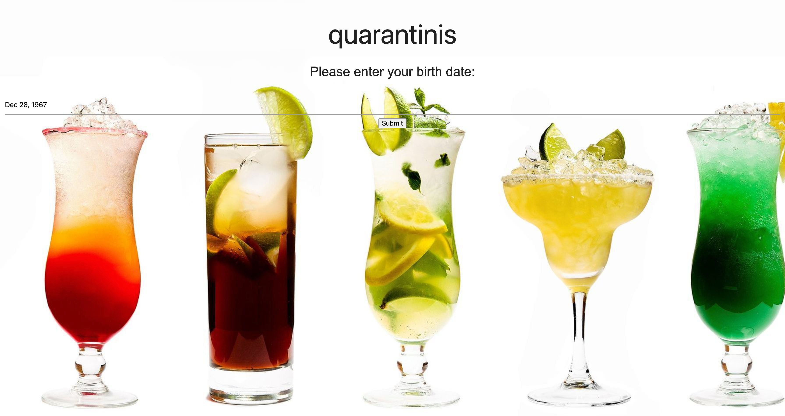
<br>
<br>
<h3><strong>Home Page</strong></h3>
<br>
- The homepage is displayed upon entry to website with 2 dropdown inputs and a submit button:
<br>
<br>
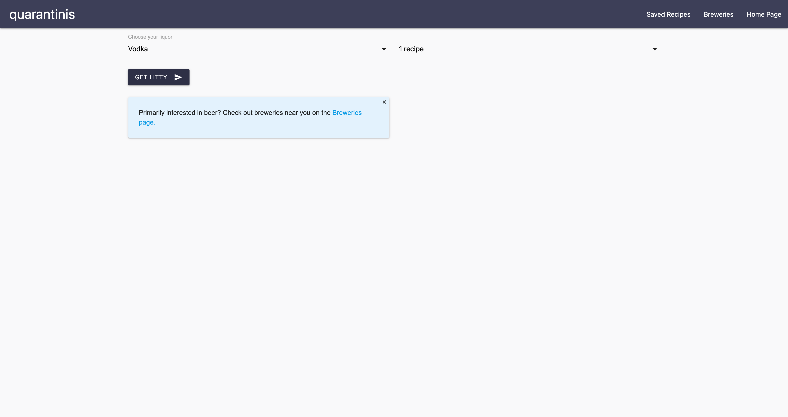
<br>
<br>
- The first dropdown lists all liquor options to sort by:
<br>
<br>
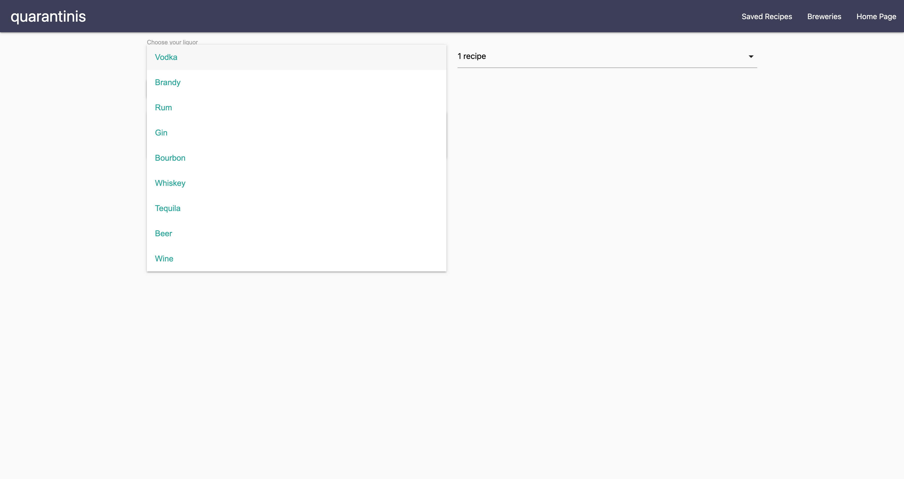
<br>
<br>
- The second dropdown lists 3 different options for desired number of recipes to return upon submitting criteria:
<br>
<br>

<br>
<br>
- Upon clicking submit, the appropriate amount of recipes are displayed in a card version based on returned information from CocktailsDB Api (user could experience receiving less recipes than requested if api database does not contain enough recipes with chosen liquor):
<br>
<br>
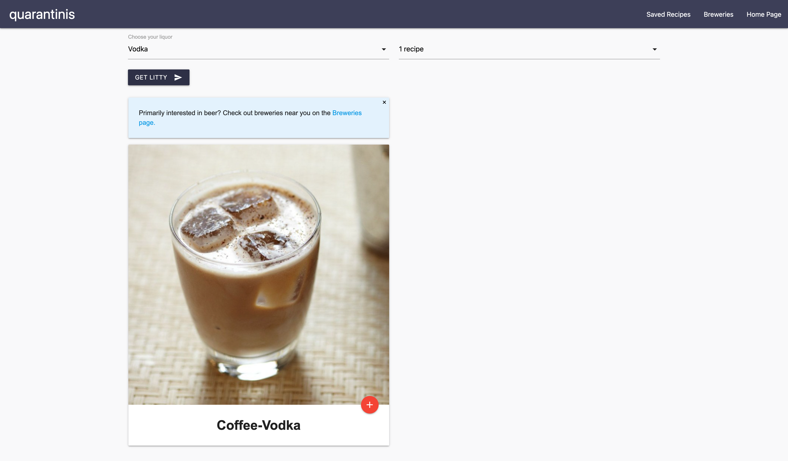
<br>
<br>
- If user clicks on red plus button on recipe card, a modal opens displaying the full recipe for that cocktail. User can choose to save the recipe from the open modal:
<br>
<br>
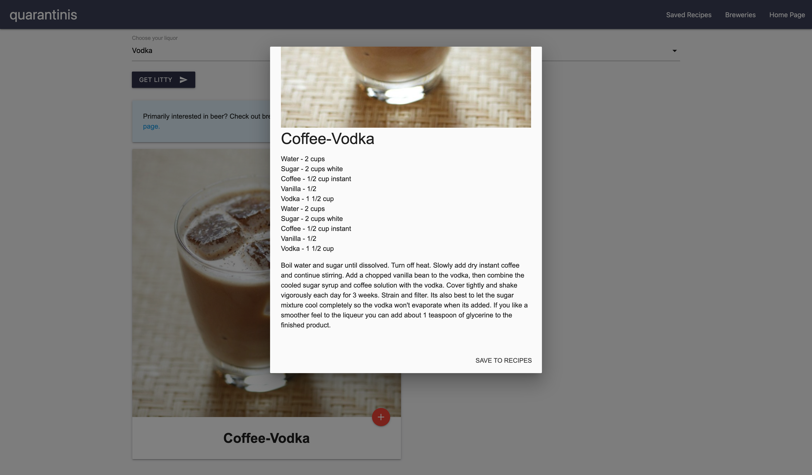
<br>
<br>
- All saved recipes are stored in local storage so user can see recipes every time page is loaded:
<br>
<br>
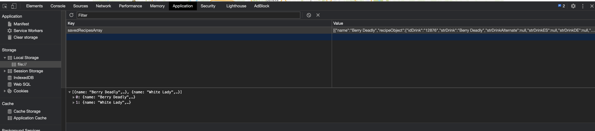
<br>
<br>
<h3><strong>Saved Recipes Page</strong></h3>
<br>
- Upon navigating to the Saved Recipes page, user is presented with a list view of all recipes that have been saved:
<br>
<br>
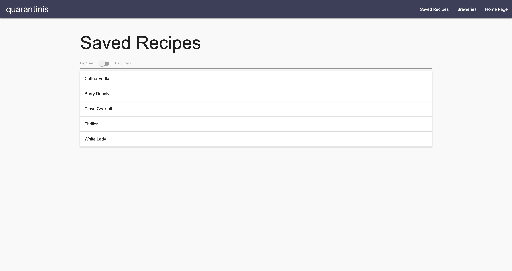
<br>
<br>
- If user opens and deletes recipe from list view, the list is displayed without that recipe and local storage is updated appropriately:
<br>
<br>
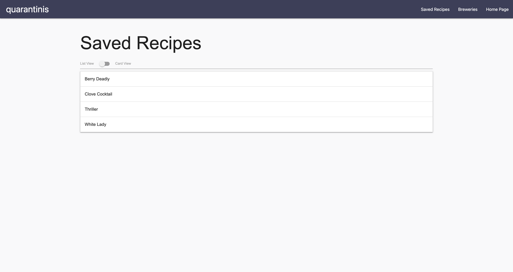
<br>
<br>
- User can toggle to card view rather than list view if desired for saved recipes:
<br>
<br>

<br>
<br>
- If user clicks on red plus button, modal opens with full recipe similar to homepage. Option to delete recipe is displayed on the modal as well:
<br>
<br>

<br>
<br>
- If recipe is deleted, card is removed from view and remainging saved recipes are displayed:
<br>
<br>
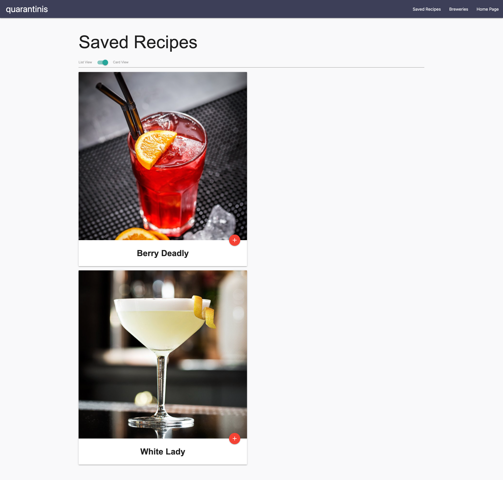
<br>
<br>
<h3><strong>Breweries Page</strong></h3>
<br>
- Upon navigating to Breweries page, user is presented with a map of the United States. Above that is a input box to enter desired city and below is an empty table that will hold information for found breweries.
<br>
<br>
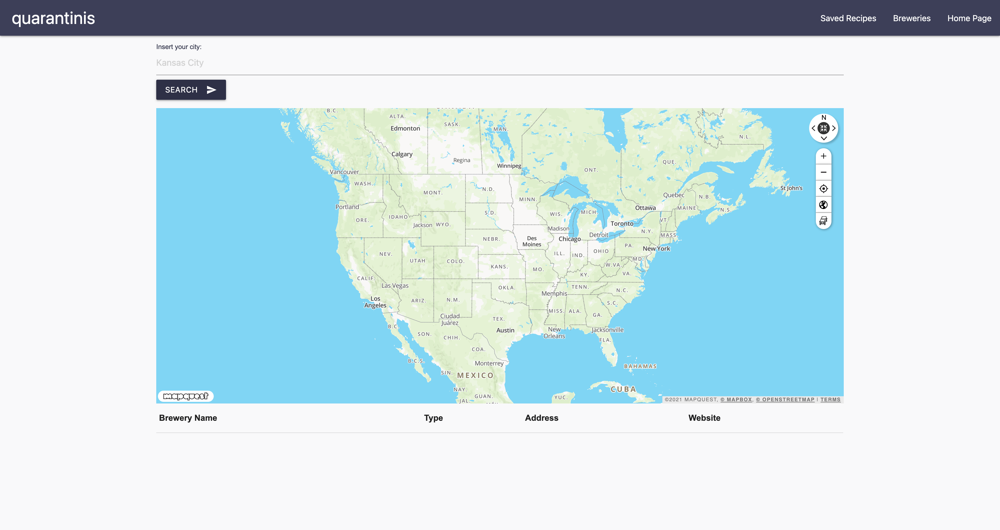
<br>
<br>
- Searching a city marks all breweries in that city that are stored in the openbrewerydb api and have coordinates available. All breweries (including those without coordinates) are listed in the table below the map:
<br>
<br>
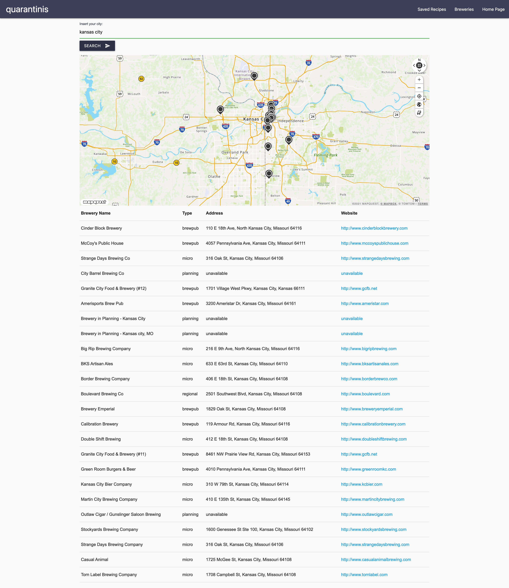
<br>
<br>

## Sources:

The Cocktail DB API - https://www.thecocktaildb.com/

OpenBreweryDB API -  https://www.openbrewerydb.org/
